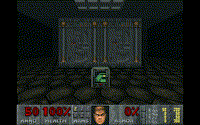

# PrBoomX

*JadingTsunami's PrBoom-Plus Fork*

This is my own personal fork of PrBoom-Plus. It contains quality-of-play upgrades that I like and you may or may not.

# Installation

* [Latest release](https://github.com/JadingTsunami/prboomX/releases/tag/prboomX-1.0.0)
* [Development builds](https://github.com/JadingTsunami/prboomX/actions)

Install [PrBoom-Plus](https://github.com/coelckers/prboom-plus) and place the binaries for prboomX alongside your `prboom-plus` executable. Run the `prboomX` executable to launch prboomX instead. Your PrBoom-Plus configuration and save data will not be affected; you can run both in parallel.

**Windows users**: You need the dependencies [here](https://github.com/coelckers/prboom-plus/releases/tag/windows_dependencies) for Windows. The DLLs are in the bin/ folder. Copy them somewhere in your PATH or alongside the other DLLs in your PrBoom-Plus/PrBoomX folder.

# Features

* Zip file support
    * Note all WAD/DEH/BEX in the zip will be loaded
* Drop-down console (default key bind: `~`)
    * 16-command history, use up/down arrows
    * Cheats work in the console
    * Tab completion for commands/settings/cheats
    * Command listing below
* "Buddha" cheat similar to GZDoom
* Targeted massacre cheat: `tntsem`
    * Kills only monsters currently targeting the player
* Optional uncapped framerate limiting
* Option to organize save games based on loaded content (WAD, DEH, etc.)
    * Note the order in which content is loaded matters
* Option to skip QuickSave/QuickLoad confirmation prompt
* Option to skip save confirmation message
* Option to fix the Blockmap bug (uses blockmap bug fix from Terry Hearst, adapted from similar PR for Woof)
* Option to allow things to move over/under other things (see [Defined CVARs](#defined-cvars) section)
* Option to change player automap arrow to a chevron shape (easier to see direction at a distance)
* Option to announce reaching 100% kills, items and/or secrets
* [COMPLVL](https://doomwiki.org/wiki/COMPLVL) lump support for supported compatibility levels
* Note-taking console command
    * Jot down quick notes while playtesting. Notes go into a dated text file in the current working directory.
    * Each note lists the time, all loaded WAD files, player position, and an optional user-supplied message on the console.
    * Example: `note demon is stuck in the wall here`.
    * **NEW**: `noteshot` will include screenshots of the screen and automap. Useful if you will post your feedback to forum threads, discord channels, etc.
* Time Warp: Travel forward and backwards in time while playing.
    * Time travel even if you died or made it to a new level.
    * Enable Time Warp in the PrBoomX options screen
    * May cause performance issues on older machines or on large levels.
    * Press '[' (default) to travel back in time
    * Press ']' (default) to travel forward in time
    * Stay too long in the past, and your old future will no longer be reachable.
    * Timelines can be saved to or loaded from a file
    * Timelines autoload when present and matching the loaded WAD content
    * Timeline can be autosaved on exit
    * Be warned! Time travel can be quite disorienting...
* Bind keys to console commands
    * Console command: `bind [key] [command]`
    * To unbind: `unbind [key]`
    * Binds stored in `prboomx_console.cfg`
    * Keys can be bound to multiple actions (just bind the same key more than once)
    * Key modifiers can NOT be used for key binds; e.g., Ctrl-X not possible, Shift-X not possible, etc.
    * Only "lowercase" keys (nothing with "SHIFT" pressed) can be bound
    * Keys already bound to other actions may or may not work (a warning will appear when you first bind it)
* Optional enhancements to the allmap powerup:
    * Secrets in undiscovered parts of the map are bright yellow
    * Secrets in discovered parts of the map are bright purple
    * Found secrets are dark purple
    * Lines can't be hidden from the map
    * Tag finder: Pressing "X" while in nofollow highlights the sector or line under the crosshair and shows the activating line/sector if any.
        * This lets you figure out what switches do or uncover how to open secrets if you are stuck.
        * Tag finder requires either having the Computer Area Map powerup _or_ be cheating with `iddt`.
        * (Credit to naps for the idea) Highlights enemies that need to be killed for the sector action to take effect (if any)
            * Warning: Does not work with DeHackEd use of `A_KeenDie` (yet?)
* (Credit to [dsda-doom](https://github.com/kraflab/dsda-doom/)): Fix cl11+ bug that slows down maps with large monster counts.
    * [See here for details](https://github.com/kraflab/dsda-doom/commit/dc29f0ce801f6ff910ae3fc3e6b1210ac79e87cf)

# Console commands

- `resurrect`
- `god`
- `noclip`
- `noclip2` (noclip+fly)
- `quit` / `exit`
- `print` (prints a message)
- `toggle_psprites` (turns off player weapon sprites, good for screenshots)
- `snd_sfxvolume` / `snd`
- `snd_musicvolume` / `mus`
- `kill <class>` (see also [Actor Names](https://github.com/JadingTsunami/prboomX#actor-names))
- `give <thing>`
- `note <message>` (write notes to a dated text file, useful for quick notes while playtesting)
- `noteshot <message>` (same as above, and take screenshots with and without the automap)
- `mdk`
- `plat_skip` (when enabled, press the "use" key to trigger a lift you're standing in to raise immediately)
- `bind [key] [command]` (bind any [key](https://github.com/JadingTsunami/prboomX#bindable-special-key-names) to any one or more console commands)
- `unbind [key]`
- `[config file setting]` (read config file settings from the console)
- `mapfollow` (start/stop the automap in follow mode)
- `complevel` (show current compatibility level)
- `complevel N` (change compatibility level to N where N is 0-17)
- `switchweapon N` (switch weapon to N where N 0-8 or [weapon name](https://github.com/JadingTsunami/prboomX#weapon-names))
- `freeze` (toggle freeze mode on/off)
- `set [variable] [value]` (set or create CVAR with given value)
- `unset [variable]` (delete CVAR)
- `screenshot` (take a screenshot, intended for compound keybinds)
- `cleanshot` (take a "clean" screenshot with no player sprites or messages and fullsize HUD)
- `summon <class>` (summon [class](https://github.com/JadingTsunami/prboomX#actor-names) enemy/thing/etc. to player's aim point position)
- `summonfriend <class>` (summon [class](https://github.com/JadingTsunami/prboomX#actor-names) friendly enemy/thing/etc. to player's aim point position)
- `am_summonfriend <class>` (summon [class](https://github.com/JadingTsunami/prboomX#actor-names) friendly enemy/thing/etc. to automap crosshair position)
- `am_summon <class>` (summon [class](https://github.com/JadingTsunami/prboomX#actor-names) enemy/thing/etc. to automap crosshair position)
- `am_warpto` (warp/teleport to automap crosshair position)
- `am_findsecret` (in automap, jump the cursor to be on top of the next unfound secret sector)
- `am_finditem` (in automap, jump the cursor to be on top of the next uncollected item)
- `am_findmonster` (in automap, jump the cursor to be on top of the next alive monster)
    - Credit for these `am_find*` concepts to similar cheats in [dsda-doom](https://github.com/kraflab/dsda-doom)
- `am_findkey` (in automap, jump the cursor to be on top of the next key)
- `savegame [slot]` (save game to given slot number)
- `loadgame [slot]` (load game from given slot number)
- `quicksave`
- `quickload`
- `timewarp_timeline_save` (save timewarp timeline to file)
- `timewarp_timeline_load` (load timewarp timeline from file)

# Defined CVARs

Changes to any CVARs in this list are saved on exit. In the console, `set` to 0 or `unset` a CVAR to remove it from your personal config. `set` a CVAR to 1 to enable it.

Example: `set overunder 1`

* `allmap_always` (default: off) - Always have the Computer Area Map powerup.
* `regenerate` (default: off) - Regenerate health when standing still similar to modern FPS games.
* `plat_skip` (default: off) - Platform wait skipping when use key is pressed.
* `hudadd_showfps` (default: off) - Instead of game speed, show FPS above the small status hud with kills, items and secrets.
* `showfps` (default: off) - Show current FPS in the upper-right corner.
* `r_drawplayersprites` (default: on) - Same meaning as the same-named [GZDoom CVAR](https://zdoom.org/wiki/CVARs:Display#r_drawplayersprites)
* `overunder` (default: off) - Allow things to move over/under other things (adapted from [Crispy Doom](https://github.com/fabiangreffrath/crispy-doom) and [Nugget Doom](https://github.com/MrAlaux/Nugget-Doom))
* `announce_100p_max` (default: off) - Announce when 100% kills, items, and secrets has been achieved.
* `weapon_bob_only` (default: off) - Only bob player's weapon, not the player's view.
* `autofire_rocketlauncher` (default: off) - When switching to the Rocket Launcher, continue firing if the fire button is held down
* `autofire_bfg` (default: off) - When switching to the BFG9000, continue firing if the fire button is held down

# Reference Material

## Actor Names

The relevant actor names are the same as [ZDoom](https://zdoom.org/wiki/Classes:Doom).

### Base Doom Actors

* DoomPlayer
* ZombieMan
* ShotgunGuy
* Archvile
* ArchvileFire
* Revenant
* RevenantTracer
* RevenantTracerSmoke
* Fatso
* FatShot
* ChaingunGuy
* DoomImp
* Demon
* Spectre
* Cacodemon
* BaronOfHell
* BaronBall
* HellKnight
* LostSoul
* SpiderMastermind
* Arachnotron
* Cyberdemon
* PainElemental
* WolfensteinSS
* CommanderKeen
* BossBrain
* BossEye
* BossTarget
* SpawnShot
* SpawnFire
* ExplosiveBarrel
* DoomImpBall
* CacodemonBall
* Rocket
* PlasmaBall
* BFGBall
* ArachnotronPlasma
* BulletPuff
* Blood
* TeleportFog
* ItemFog
* TeleportDest
* BFGExtra
* GreenArmor
* BlueArmor
* HealthBonus
* ArmorBonus
* BlueCard
* RedCard
* YellowCard
* YellowSkull
* RedSkull
* BlueSkull
* Stimpack
* Medikit
* Soulsphere
* InvulnerabilitySphere
* Berserk
* BlurSphere
* RadSuit
* Allmap
* Infrared
* Megasphere
* Clip
* ClipBox
* RocketAmmo
* RocketBox
* Cell
* CellPack
* Shell
* ShellBox
* Backpack
* BFG9000
* Chaingun
* Chainsaw
* RocketLauncher
* PlasmaRifle
* Shotgun
* SuperShotgun
* TechLamp
* TechLamp2
* Column
* TallGreenColumn
* ShortGreenColumn
* TallRedColumn
* ShortRedColumn
* SkullColumn
* HeartColumn
* EvilEye
* FloatingSkull
* TorchTree
* BlueTorch
* GreenTorch
* RedTorch
* ShortBlueTorch
* ShortGreenTorch
* ShortRedTorch
* Stalagtite
* TechPillar
* CandleStick
* Candelabra
* BloodyTwitch
* Meat2
* Meat3
* Meat4
* Meat5
* NonsolidMeat2
* NonsolidMeat4
* NonsolidMeat3
* NonsolidMeat5
* NonsolidTwitch
* DeadCacodemon
* DeadMarine
* DeadZombieMan
* DeadDemon
* DeadLostSoul
* DeadDoomImp
* DeadShotgunGuy
* GibbedMarine
* GibbedMarineExtra
* HeadsOnAStick
* Gibs
* HeadOnAStick
* HeadCandles
* DeadStick
* LiveStick
* BigTree
* BurningBarrel
* HangNoGuts
* HangBNoBrain
* HangTLookingDown
* HangTSkull
* HangTLookingUp
* HangTNoBrain
* ColonGibs
* SmallBloodPool
* BrainStem

### Boom/MBF Additions

* PointPusher
* PointPuller
* MBFHelperDog
* PlasmaBall1
* PlasmaBall2
* EvilSceptre
* UnholyBible
* MusicChanger
* Deh_Actor_145
* Deh_Actor_146
* Deh_Actor_147
* Deh_Actor_148
* Deh_Actor_149

### DEHEXTRA Additions

* Deh_Actor_150
* Deh_Actor_151
* Deh_Actor_152
* Deh_Actor_153
* Deh_Actor_154
* Deh_Actor_155
* Deh_Actor_156
* Deh_Actor_157
* Deh_Actor_158
* Deh_Actor_159
* Deh_Actor_160
* Deh_Actor_161
* Deh_Actor_162
* Deh_Actor_163
* Deh_Actor_164
* Deh_Actor_165
* Deh_Actor_166
* Deh_Actor_167
* Deh_Actor_168
* Deh_Actor_169
* Deh_Actor_170
* Deh_Actor_171
* Deh_Actor_172
* Deh_Actor_173
* Deh_Actor_174
* Deh_Actor_175
* Deh_Actor_176
* Deh_Actor_177
* Deh_Actor_178
* Deh_Actor_179
* Deh_Actor_180
* Deh_Actor_181
* Deh_Actor_182
* Deh_Actor_183
* Deh_Actor_184
* Deh_Actor_185
* Deh_Actor_186
* Deh_Actor_187
* Deh_Actor_188
* Deh_Actor_189
* Deh_Actor_190
* Deh_Actor_191
* Deh_Actor_192
* Deh_Actor_193
* Deh_Actor_194
* Deh_Actor_195
* Deh_Actor_196
* Deh_Actor_197
* Deh_Actor_198
* Deh_Actor_199
* Deh_Actor_200
* Deh_Actor_201
* Deh_Actor_202
* Deh_Actor_203
* Deh_Actor_204
* Deh_Actor_205
* Deh_Actor_206
* Deh_Actor_207
* Deh_Actor_208
* Deh_Actor_209
* Deh_Actor_210
* Deh_Actor_211
* Deh_Actor_212
* Deh_Actor_213
* Deh_Actor_214
* Deh_Actor_215
* Deh_Actor_216
* Deh_Actor_217
* Deh_Actor_218
* Deh_Actor_219
* Deh_Actor_220
* Deh_Actor_221
* Deh_Actor_222
* Deh_Actor_223
* Deh_Actor_224
* Deh_Actor_225
* Deh_Actor_226
* Deh_Actor_227
* Deh_Actor_228
* Deh_Actor_229
* Deh_Actor_230
* Deh_Actor_231
* Deh_Actor_232
* Deh_Actor_233
* Deh_Actor_234
* Deh_Actor_235
* Deh_Actor_236
* Deh_Actor_237
* Deh_Actor_238
* Deh_Actor_239
* Deh_Actor_240
* Deh_Actor_241
* Deh_Actor_242
* Deh_Actor_243
* Deh_Actor_244
* Deh_Actor_245
* Deh_Actor_246
* Deh_Actor_247
* Deh_Actor_248
* Deh_Actor_249

## Weapon Names

Sub-bullets list accepted alternate names for weapons.

* fist
* chainsaw
* pistol
* shotgun
* supershotgun
    * super shotgun
    * ssg
    * shotgun2
* chaingun
    * minigun
* rocket launcher
    * rocketlauncher
    * rl
* plasma rifle
    * plasmarifle
    * plasmagun
    * plasma gun
* bfg
    * bfg9000
    * bfg-9000
    * bfg 9000

## Bindable Special Key Names

* RIGHTARROW
* LEFTARROW
* UPARROW
* DOWNARROW
* ESCAPE
* ENTER
* TAB
* F1
* F2
* F3
* F4
* F5
* F6
* F7
* F8
* F9
* F10
* F11
* F12
* BACKSPACE
* PAUSE
* EQUALS
* MINUS
* RSHIFT
* RCTRL
* RALT
* LALT
* CAPSLOCK
* PRINTSC
* INSERT
* HOME
* PAGEUP
* PAGEDOWN
* DEL
* END
* SCROLLLOCK
* SPACEBAR
* NUMLOCK
* KEYPAD0
* KEYPAD1
* KEYPAD2
* KEYPAD3
* KEYPAD4
* KEYPAD5
* KEYPAD6
* KEYPAD7
* KEYPAD8
* KEYPAD9
* KEYPADENTER
* KEYPADDIVIDE
* KEYPADMULTIPLY
* KEYPADMINUS
* KEYPADPLUS
* KEYPADPERIOD
* MWHEELUP
* MWHEELDOWN
* MOUSE1
* MOUSE2
* MOUSE3
* MOUSE4
* MOUSE5
* MOUSE6
* MOUSE7
* MOUSE8

# Added Sound Credits

* All Secrets Found (`DSSECALL`)
    * [Win Sound Effect](https://opengameart.org/content/win-sound-effect) by [Listener](https://opengameart.org/users/listener), CC0
    * [Sound Pack 01](https://opengameart.org/content/level-up-power-up-coin-get-13-sounds) by [wobbleboxx](https://opengameart.org/users/wobbleboxx), CC0
* Secret Found (`DSSECRET`)
    * [GUI Sound Effects](https://opengameart.org/content/gui-sound-effects) by [Lokif](https://opengameart.org/users/lokif), CC0
* All Items Found (`DSITMALL`)
    * [Intro Jingle](https://opengameart.org/content/nes-shooter-music-5-tracks-3-jingles) by [SketchyLogic](https://opengameart.org/users/sketchylogic), CC0
* All Monsters Killed (`DSKILALL`)
    * [Sound Pack 01](https://opengameart.org/content/level-up-power-up-coin-get-13-sounds) by [wobbleboxx](https://opengameart.org/users/wobbleboxx), CC0
    * [The Ritual](https://opengameart.org/content/the-ritual) by [northivanastan](https://opengameart.org/users/northivanastan), CC0
* Max 100% Announcement (`DSMAXALL`)
    * [Cure7](https://opengameart.org/content/cure-magic) by [Someoneman](https://opengameart.org/users/someoneman), CC0
